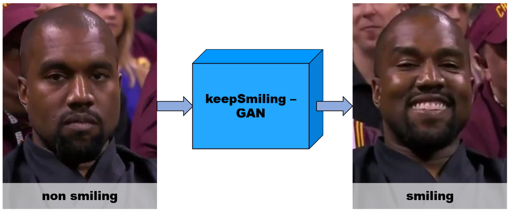
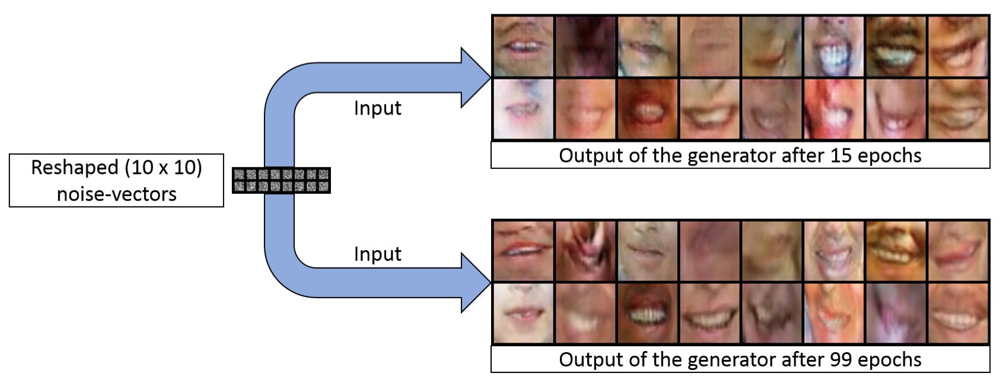

# KeepSmiling - Generative Adversarial Networks for Face Manipulation

The motivation for this project was to make everyone smile in photos. Group photos often have individuals who are not smiling, which can make the overall photo less joyful and positive. To address this, we used Generative Adversarial Networks (GANs) to transform non-smiling faces into smiling ones in a post-processing step.

Several GAN setups were constructed and tested to achieve this goal. The main approaches used were:

1. **[SimpleGAN](#SimpleGAN):** A simple GAN based on this [DCGAN](https://github.com/pytorch/tutorials/blob/main/beginner_source/dcgan_faces_tutorial.py) model, trained on a subset [dataset](#Dataset) of just smiling faces, checking the capability of generating smiling images.
2. **[ComplexGAN](#ComplexGAN)**: A more complex DCGAN setup based on the [StarGAN](https://github.com/yunjey/stargan) model, trained on a [dataset](#Dataset) of smiling and non-smiling faces. Its Generator network  has an autoencoder-like structure and its Discriminator determines both whether the image is fake or not and whether it is smiling or not, allowing to force the Generator to convert non-smiling faces to smiling ones.
3. **[SplitGAN](#SplitGAN)**: A DCGAN setup with an autoencoder Generator and a default Discriminator, trained on a [dataset](#Dataset) of smiling and non-smiling faces. Thh Generator consists of a separate encoder and decoder, enabling nonsmiling-to-smiling transformation in latent space.

|   |
|:---|
|**Motivation behind KeepSmiling:** GAN transforms the non-smiling person into a smiling one.[[image&#160;source]](https://www.mirror.co.uk)|

## Table of Contents
1. [Dataset](#Dataset)
2. [Dependencies](#Dependencies)
3. [Results](#Results)
4. [Acknowledgements](#Acknowledgements)

## Dataset

- The dataset [Facial Landmark Detection by Deep Multi-task Learning](https://link.springer.com/chapter/10.1007/978-3-319-10599-4_7) by Zhang et. al. was used for this project. It contains images of faces from a frontal view that are either smiling or not smiling and was equipped with five predetermined coordinates marking the position of certain face regions, including the positions of both eyes, the nose, and the corners of the mouth.
- Due to a lack of time and powerful hardware, the focus of this project was set on the smiling mouth as the most striking characteristic of a smiling face. The cropping procedure is described in detail in the [report](docs/report/smiling_project_report_grimm_maus.pdf).

## Dependencies

To run the code in these projects, you will need to have the following dependencies installed:

- `Python 2.7`
- `Pytorch 1.0.0+`
- `torchvision 0.2.1+`
- `numpy`
- `PIL`
- `os`
- `TensorFlow 1.1.0+` (for tensorboard)
- `Linux`

## Results

The results of the different DCGAN setups are described briefly below:

### SimpleGAN
- **Code used:**  [`main_simpleGAN.py`](main_simpleGAN.py)
- **Model:** DCGAN setup ([Generator](https://github.com/emanuelmaus/KeepSmiling/blob/2e4777c51aa3e3da6e46e8b0ddcbcd12d9922d15/model.py#L23) and [Discriminator](https://github.com/emanuelmaus/KeepSmiling/blob/2e4777c51aa3e3da6e46e8b0ddcbcd12d9922d15/model.py#L226))
- **Objective:** Train the setup on only smiling images to test if the Generator network can produce realistic smiling mouths.

|   |
|:---|
|**SimpleGAN results:** Differently trained Generator networks transform the same random noise vectors to smiles.|

- **Conclusion:** The DCGAN setup enables the Generator network to effectively generate fake smiles. Longer training led to more detailed generated images, proofing the GAN learning strategy is the ideal candidate for the non-smile to smile transformation.

### ComplexGAN

- **Code used:**  [`main_complexGAN.py`](main_complexGAN.py)
- **Model:** StarGAN setup ([Generator](https://github.com/emanuelmaus/KeepSmiling/blob/2e4777c51aa3e3da6e46e8b0ddcbcd12d9922d15/model.py#L63) and [Discriminator](https://github.com/emanuelmaus/KeepSmiling/blob/2e4777c51aa3e3da6e46e8b0ddcbcd12d9922d15/model.py#L265))
- **Objective:** Train the setup on non- and smiling images with additional target labels for the Generator's output. Using this setup, the user can force the Generator network to generate the smiling copies of the nonsmiling input images through the target labels.

|   |
|:---|
|**ComplexGAN results:** The Generator network transforms some input images to non-smiling or smiling images based on the target labels (1: non-smiling, 0: smiling). The Generator should be able to map non-smiling to smiling and vice versa when the correct target label is set.|

- **Conclusion:** The deeper network architectures and additional constraints made the generator require more training to achieve the desired performance. The misbalance of the individual loss terms (see Section 3.2.1 in the [report](docs\report\smiling_project_report_grimm_maus.pdf)) may also have contributed to this non-convergent behavior. Due to limited time and hardware performance, this setup was not pursued further, but it could be a good candidate for further exploration.

### SplitGAN

#### Reconstruction

- **Code used:**  [`main_splitGAN.py`](main_splitGAN.py)
- **Model:** Networks based on StarGAN (Generator ([Encoder](https://github.com/emanuelmaus/KeepSmiling/blob/2e4777c51aa3e3da6e46e8b0ddcbcd12d9922d15/model.py#L137) + [Decoder](https://github.com/emanuelmaus/KeepSmiling/blob/2e4777c51aa3e3da6e46e8b0ddcbcd12d9922d15/model.py#L180)) and [Discriminator](https://github.com/emanuelmaus/KeepSmiling/blob/2e4777c51aa3e3da6e46e8b0ddcbcd12d9922d15/model.py#L226))
- **Objective:** Train the setup on non- and smiling images using a Generator that is split into an Encoder and Decoder network. The Encoder maps each input image to a latent vector and the Decoder transforms it back to a reconstruction of the original input image. This setup enables the possibility to operate in latent space and convert a nonsmile-to-smile transformation into a simple latent space translation.

|   |
|:---|
|**SplitGAN reconstruction results:** The Encoder network maps input images to lower-dimensional latent vectors, which are the transformed back to image by the Decoder. Due to the reconstruction constraints, the decoded images have similar characteristics (size of the mouth, background-foreground ratio, etc.) as the original input images.|

- **Conclusion:** The reconstruction of the split Generator performs well, accurately reconstructing both the back- and foreground. It is also capable of transforming smiling faces to smiling ones and vice versa, with even more complicated features (such as the shape of the mouth and nose) often being reconstructed correctly. However, it should be noted that the dataset used for training has a light skin bias, resulting in dark skin tones being reconstructed as light skin tones. Despite this, the Generator is able to reconstruct both smiles and nonsmiles and can be utilized for the project's aim.

#### Domain Translation

- **Code used:**
	- Encode and store all latent vectors of the dataset: [`encoder_splitGAN.py`](encoder_splitGAN.py)
	- Calculate certain statistical characteristics of the latent vectors of the smiling and nonsmiling domains: [`feature_vectors_calculations.py`](feature_vectors_calculations.py)
	-  Encode nonsmiling images, translate their encoded latent vectors to the smiling domain region, and decode them: [`translation_splitGAN.py`](translation_splitGAN.py)
- **Model:** Previously trained Generator ([Encoder](https://github.com/emanuelmaus/KeepSmiling/blob/2e4777c51aa3e3da6e46e8b0ddcbcd12d9922d15/model.py#L137) + [Decoder](https://github.com/emanuelmaus/KeepSmiling/blob/2e4777c51aa3e3da6e46e8b0ddcbcd12d9922d15/model.py#L180))
- **Objective:** Use the trained Generator to encode all smiling and nonsmiling images to its latent vectors. Determine the translation vector between the latent vector centers of the two different domains. If smiles and nonsmiles are encoded in different regions, adding this translation vector leads to a domain shift and a nonsmiling mouth can be transformed to a smiling one and vice versa, potentially even preserving certain characteristics of the original nonsmiling images.

|   |
|:---:|
|**Domain translation results:** The left figure shows real samples of smiling mouths (ORG) domain-translated to nonsmiling mouths (GEN), and the right figure the opposite. In addition to the effects of reconstruction (light skin color bias), the domain translation preserves both background and foreground regions and the main mouth features. The domain translation also leads to a change in the main characteristics of smiling and nonsmiling mouths (lower mouth corners, no visible teeth vs. higher mouth corners, visible teeth).|

- **Conclusion:** The results indicate that this simple translation in latent space can change the smiling state of the encoded image while preserving the main mouth characteristics and the background and foreground regions. This demonstrates the existence of a smiling and non-smiling domain in latent space. The fact that the Encoder has no further information on whether the input is smiling or not implies that it learns to cluster key features of a smiling mouth (high mouth corners and visible teeth) and of a non-smiling mouth (low mouth corners and closed mouth) in an unsupervised manner. Therefore, this setup is an ideal candidate for our KeepSmiling network and fulfills our ambition. Further improvement, such as providing non- and smiling labels to the Generator and adding contrastive learning to improve the separation of the domains in latent space, could potentially lead to even better results.

### Further information

For more detailed information about the results, please check accompanying [poster](docs/poster/smiling_poster_maus_grimm.pdf) or [project report](docs/report/smiling_project_report_grimm_maus.pdf).

## Acknowledgements

This work was developed and completed by Johannes&#160;Grimm and Emanuel&#160;Maus as the final project for the "Object Recognition and Image Understanding" course taught by Prof.&#160;Dr.&#160;Björn Ommer at Heidelberg University in 2018.
