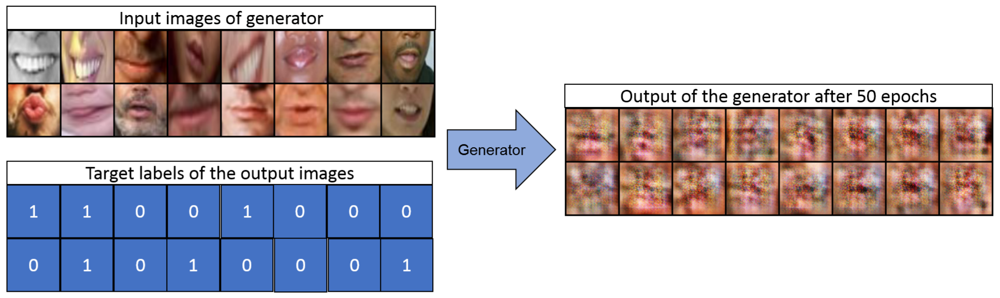

# KeepSmiling - Generative Adversarial Networks for Face Manipulation
>Research project: KeepSmiling - Generative Adversarial Networks for Face Manipulation

## Motivation

Motivation for this project was to make everyone smile on photos. As it is the
nature of group photos, that not all persons shown smile at the same time, we used Generative Adverisal Networks to transform non-smiling faces to smiling one in a post-processing step. Thereby, we tested different neural network setups and did various experiments on the trained networks to fulfill this ambitions.

|   |
|:------------------------------------------------------------------------------------------:|
|**Motivation behind KeepSmiling:** GAN transforms the non-smiling person into a smiling one.[[image source]](https://www.mirror.co.uk)|

## Description

During this project several GAN-like setups were constructed and tested in
regard to the project's aim. These setups can be distinct by 3 approaches,
briefly summarized as follows:

1. **SimpleGAN:** Simple generative adverisal network based on [this DCGAN](https://github.com/pytorch/tutorials/blob/main/beginner_source/dcgan_faces_tutorial.py), which was trained on the described dataset and resulted the smiling images shown in [this section](#SimpleGAN).
2. **ComplexGAN**: More complex GAN setup, in which the generator and discriminator
   are deeper and based on [StarGAN](https://github.com/yunjey/stargan). Furthermore, the generator has an autoencoder-like structure and the discriminator should determine, whether it is a fake or not and whether it is smiling or not. Its results are
   shown [here](ComplexGAN).
3. **SplitGAN**: In this GAN setup the generator is an autoencoder consisting of a
   separate encoder and decoder enabling nonsmiling-to-smiling transformation in latent space. [This section](#SplitGAN) contains its results.

## Dataset

- The dataset [Facial Landmark Detection by Deep Multi-task Learning](https://link.springer.com/chapter/10.1007/978-3-319-10599-4_7) by Zhang et. al. was used for this project. It contains images of faces from frontal view, which smile and do
not smile, and was equipped with 5 pre-determined coordinates, which marked
the position of certain face regions. This includes the positions of both eyes, the
nose and the left corner of the mouth, as well as the right corner of the mouth.
- Due to lack of time and powerful hardware the focus of this project was set
    to the smiling mouth as the most stiking characteristic of a smiling face.
    The cropping procedure is described in detail in the [report](docs\report\smiling_project_report_grimm_maus.pdf).

## Dependencies

- `Python 2.7`
- `Pytorch 1.0.0+`
- `torchvision 0.2.1+`
- `TensorFlow 1.1.0+` (for tensorboard)
- `numpy`
- `PIL`
- `os`
- `Linux`

## Results

The results of the project are described briefly here, but are well summarized
on [this poster](docs\poster\smiling_poster_maus_grimm.pdf) or elaborated in more depth in the [project report](docs\report\smiling_project_report_grimm_maus.pdf).

### SimpleGAN
- **Code used:**  [main_simpleGAN.py](main_simpleGAN.py)
- **Model:** DCGAN setup ([Generator](model.py#99) and [Discriminator](model.py#288))
- **Objective of this experiment:** Train the setup on only smiling images in order to test if the Generator
	    network can generate realistic smiling mouths.

|   |
|:-----------------------------------------------------------------------------------------------------:|
|**SimpleGAN results:** Differently trained Generator networks transform the same random noise vectors to smiles.|

- **Conclusion:** The DCGAN setup enables the Generator network to learn
    producing fake smiles quite effectively. Longer training led to more
    details in the generated images and therefore it is the ideal candidate for
    our non-smile to smile idea.

### ComplexGAN

- **Code used:**  [main_complexGAN.py](main_complexGAN.py)
- **Model:** StarGan setup ([Generator](model.py#25) and [Discriminator](model.py#229))
- **Objective of this experiment:** Train the setup on non- and smiling images with additional target labels of the Generator's output. This setup enables the user to force the Generator network through the target labels to produce the smiling copy of the nonsmiling input images.

|   |
|:------------------------------------------------------------------------------------------------------------------------------------------------------------:|
|**ComplexGAN results:** Generator network transforms some input images to
ideally non- or smiling images based on the target labels (1: non-smiling, 0:
smiling). The Generator should be able to map non-smiling to smiling and vice
versa, when the correct target label is set.|

- **Conclusion:** Due to the deeper network architectures and the additional
    constraints the Generator needs more training to archieve performances
    needed for this task, as the output in later epochs seems to match outputs
    of the DCGAN in early training stages. Furthermore, the right balancing of
    each loss term (see section 3.2.1 in the [report](docs\report\smiling_project_report_grimm_maus.pdf)) possibly led also to this non-converage behaviour. Because of the limited time and hardware power (the comparable StarGAN was trained on a high-end GPU for 24 hours) this setup was not considered further, but might be a good starting point for future work.

### SplitGAN

#### Reconstruction

- **Code used:**  [main_splitGAN.py](main_splitGAN.py)
- **Model:** Networks based on StarGan (Generator ([Encoder](model.py#25) + [Decoder](model.py#25)) and [Discriminator](model.py#229))
- **Objective of this experiment:** Train the setup on non- and smiling images. The Generator is split into an Encoder and Decoder - Network mapping each input image to a latent vector like an Autoencoder network. This setup enables the possibility to operate in the latent space and convert a nonsmile-to-smile transformation into a simple translation in the latent space, if the smile and nonsmiling images are encoded in different, separable regions.

|   |
|:------------------------------------------------------------------------------------------------------------------------------------------------------------:|
|**SplitGAN reconstruction results:** Encoder network maps some input images to
lower dimensional latent vectors. The decoder network transforms these vectors back to images. Due to the reconstruction constraints the decoded images have similar characteristics (size of the mouth, back- and foreground ration, etc.) as the original input images.|

- **Conclusion:** The reconstruction of the split Generator is performing well.
    It is capable to reconstruct the back- and foreground accordingly.
    Additionally it is in most cases capable of transforming smiling faces to smiling ones and
    vice versa. Even more complicated features (shapes of mouths and noses) are
    often reconstructed correctly. Interstingly, the dataset the setup was
    trained on has a light skin bias, since dark skin color got reconstructed as
    light skin color. Besides, the Generator itself is able to reconstruct both
    smiles and nonsmiles and can be utilized for the project's aim.

#### Domain Translation

- **Code used:**
	- Encode and store all latent vectors of the dataset: [encoder_splitGAN.py](encoder_splitGAN.py)
	- Calculate certain statistical characteristics of the latent vectors of the smiling and nonsmiling domains: [feature_vectors_calculations.py](feature_vectors_calculations.py)
	-  Encode nonsmiling images, translate its encoded latent vectors to the smiling domain region and decode it: [translation_splitGAN.py](translation_splitGAN.py)
- **Model:** Previously trained Generator ([Encoder](model.py#140) + [Decoder](model.py#183))
- **Objective of this experiment:** The trained Generator is used to encode all
    smiling and nonsmiling images to its latent vectors. The translation vector
    between the latent vector center of the two different domains is determined. In case smiles and nonsmiles are learnt to be encoded in different region in the latent space, adding this translation vector leads to a domain shift and a nonsmiling mouth can be transformed to a smiling one and vice versa. Ideally, this method may even preserve certain characteristics of the original nonsmiling images.

|   |
|:------------------------------------------------------------------------------------------------------------------------------------------------------------:|
|**Domain translation results:** The left figure shows real samples of smiling
mouths domain-translated to nonsmiling mouths and the right figure the opposite. Besides the effects of the reconstruction (light skin color bias) the domain translation preserves both background- and foreground regions and the main mouth features. In addition, the domain translation leads to a change of the main characteristics of smiling and nonsmiling mouths (lower mouth corners, no visible teeth vs. higher mouth corners, visible teeth).|

- **Conclusion:** The domain translation vector is based on the shift vector between the center of the two different domain regions. The results indicates, that this simple translation in the latent space can change the smiling state of the encoded image while preserving the main mouth characteristics and the background- and foreground regions. This proves the existence of a smiling and non-smiling domain in latent space. As the Encoder has no further information, whether input is smiling or not, implies, that the Encoder learns to cluster key features of a smiling mouth (high mouth corners and showing of teeth) and of a nonsmiling mouth (low mouth corners and closed mouth) in unsupervised manner.  Therefore, this setup is an ideal candidate for our KeepSmiling network and fulfills our ambition. Further improvement, like providing non- and smiling labels to the Generator, adding a contrastive learning to improve the latent space clustering and optimize the dataset, may lead to performance boost.
## Acknowledgements

This work was developed and realized by Johannes Grimm and Emanuel Maus as the final project of the lecture "Object Recognition and Image Understanding" given by Prof. Dr. Björn Ommer in 2018.
